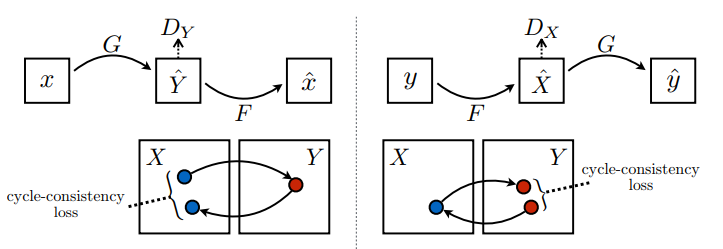
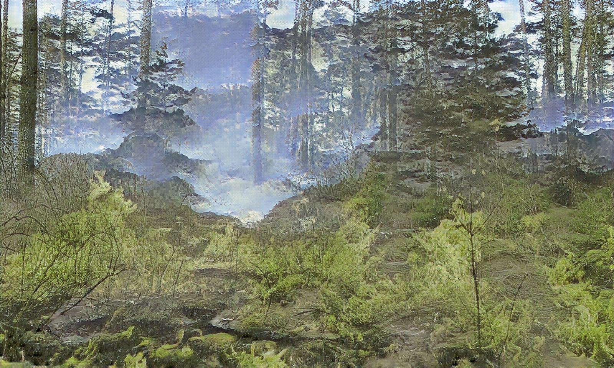

# Тема: Генерация изображений
# Студент: Королев Игорь
# Stepik id: 56627433

## Содержание  
1. [Постановка задачи](#problem_formulation)
2. [Описание модели CycleGAN](#model_description)  
    2.1 [Содержимое модели](#model_content)  
    2.2 [Функции ошибок](#loss_functions)
3. [Обучение модели CycleGAN](#train_model_cyclegan)  
    3.1 [Обучение на датасете horse2zebra (Задача 1)](#train_horse2zebra)  
    3.2 [Обучение на датасете Forest Fire (Задача 2)](#train_forest_fire)  
4. [Инструкция для запуска](#launch_interface)  
    4.1 [Запуск обучения](#train_interface)  
    4.2 [Запуск генерации изображений](#eval_interface)  
5. [Вывод](#conclusion)


<a name="problem_formulation"><h2>1. Постановка задачи</h2></a>

Выполнить задачу по преобразованию изображений с помощь модели CycleGAN. 

* Реализовать модель и протестировать ее на решенной задаче (в данном решении - датасет **horse2zebra**).
* Выбрать другой датасет для своей задачи и постараться обучить модель под него (в данном решении - датасет **Forest Fire**).
* Сделать интерфейс для запуска обучения модели и генерации изображений.


<a name="model_description"><h2>2. Описание модели CycleGAN</h2></a>

Модель CycleGAN состоит из двух генераторов и двух дискриминаторов. 
Генераторы пытаются преобразовать изображения одного типа в изображения другого типа (генератор 1 - $A \rightarrow B$, генератор 2 - $B \rightarrow A$).
Дискриминаторы пытаются определить является ли рассматриваемое изображение определенного типа настоящим или сгенерированным (дискриминатор 1 - для изображений $A$, дискриминатор 2 - для изображений $B$).


<a name="model_content"><h3>2.1 Содержимое модели</h3></a>

Модель состоит сверточных слоев, слоев нормализации и функций активации, которые в совокупности образуют конволюционные блоки и блоки остаточных связей.

Конволюционный блок состоит из сверточного слоя, который выполняет свертку изображения с помощью ядер свертки, слоя InstanceNorm2d, применяемого для нормализации экземпляра входного тензора, а также функции активации. Для созданного блока можно изменять количество каналов, размеры ядра, сдвиг по тензору, паддинг, также есть возможность отражения границ изображения для сохранения информации о краях изображения. А также есть возможность убирать функцию активации или изменять ее.

```python
# Конволюционный блок
class ConvolutionalBlock(nn.Module):
    def __init__(self,
                 in_channels: int = 3,
                 out_channels: int = 3,
                 kernel_size: int = 3,
                 stride: int = 1,
                 padding: int = 1,
                 reflection_padding: int = 0,
                 activation_func: nn.modules.activation = nn.ReLU(inplace=True)) -> None:
        super(ConvolutionalBlock, self).__init__()

        conv_block = []

        # Если указано дополнение входного тензора, то выполняется отражение его границ (дополняет указанное количество пикселей к граням входного тензора)
        if reflection_padding > 0:
            conv_block += [nn.ReflectionPad2d(padding=reflection_padding)]

        # При увеличении каналов выполняется свертка, при уменьшении - развертка
        if in_channels <= out_channels:
            conv_block += [nn.Conv2d(in_channels=in_channels, out_channels=out_channels, kernel_size=kernel_size, stride=stride, padding=padding)]
        else:
            conv_block += [nn.ConvTranspose2d(in_channels=in_channels, out_channels=out_channels, kernel_size=kernel_size, stride=stride, padding=padding, output_padding=padding)]

        # Нормализация экземпляров
        conv_block += [nn.InstanceNorm2d(num_features=out_channels)]

        # Если указана функция активации, то она добавляется в конец
        if activation_func is not None:
            conv_block += [activation_func]

        self.conv_block = nn.Sequential(*conv_block)

    def forward(self, x) -> torch.Tensor:
        return self.conv_block(x)
```

Блок остаточных связей состоит из двух конволюционных блоков. В отличие от самих конволюционных блоков он сохраняет информацию из предыдущего слоя и добавляет ее к итоговому выходу. 

```python
# Блок остаточных связей (состоит из двух конволюционных блоков)
class ResidualBlock(nn.Module):
    def __init__(self,
                 num_channels: int = 3) -> None:
        super(ResidualBlock, self).__init__()

        # Два конволюционных блока (во втором нет функции активации)
        res_block = [ConvolutionalBlock(in_channels=num_channels, out_channels=num_channels, kernel_size=3, stride=1, padding=0, reflection_padding=1, activation_func=nn.ReLU(inplace=True))]
        res_block += [ConvolutionalBlock(in_channels=num_channels, out_channels=num_channels, kernel_size=3, stride=1, padding=0, reflection_padding=1, activation_func=None)]

        self.res_block = nn.Sequential(*res_block)

    def forward(self, x) -> torch.Tensor:
        return x + self.res_block(x)
```

При подаче тензора изображения генератору в начале выполняется увеличение количества каналов с сохранением изначальных размеров (ширины и высоты). Далее выполняется уменьшение размерности (Downsampling), пропускание через блоки остаточных связей, после чего выполняется увеличение размерности (Upsampling) и возвращение тензора к размерности, в которой он был подан генератору в начале.

```python
# Генератор
class Generator(nn.Module):
    def __init__(self,
                 channels: list = [3, 64, 128, 256, 512],
                 residual_blocks: int = 3):
        super(Generator, self).__init__()

        # Конволюционных блок, который переводит тензор изображения [3 x img_size x img_size] в тензор [64 x img_size x img_size] (увеличивается количество каналов, оставляя исходный размер изображения)
        blocks = [ConvolutionalBlock(in_channels=channels[0], out_channels=channels[1], kernel_size=7, stride=1, padding=0, reflection_padding=3)]


        # Уменьшение размерности (Downsampling)
        in_channels = channels[1]
        for out_channels in channels[2:]:
            blocks += [ConvolutionalBlock(in_channels=in_channels, out_channels=out_channels, kernel_size=3, stride=2, padding=1)]
            in_channels = out_channels


        # Добавление блоков остаточных связей
        for _ in range(residual_blocks):
            blocks += [ResidualBlock(num_channels=in_channels)]


        # Увеличение размерности (Upsampling)
        for out_channels in channels[-2:0:-1]:
            blocks += [ConvolutionalBlock(in_channels=in_channels, out_channels=out_channels, kernel_size=3, stride=2, padding=1)]
            in_channels = out_channels


        # Преобразование тензоров к исходной размерности изображений
        blocks += [nn.ReflectionPad2d(padding=3)]
        blocks += [nn.Conv2d(in_channels=channels[1], out_channels=channels[0], kernel_size=7, stride=1)]
        blocks += [nn.Tanh()]                                                                                   # Чтобы не было проблем с цветами изображений

        self.model = nn.Sequential(*blocks)

    def forward(self, x) -> torch.Tensor:
        return self.model(x)
```

Архитектуру генератора можно увидеть на следующем изображении:


При подаче тензора изображения дискриминатору, который по архитектуре похож на энкодер, выполняется свертка тензора с уменьшением размерности и увеличением количества каналов. С помощью функции AvgPool2d выполняется нахождение среднего значения по всем сверткам. В итоге получается тензор размерности [1, 1] (при батче размера 1), который показывает к какому классу дискриминатор отнес рассматриваемое изображение (настоящее / сгенерированное).

```python
# Дискриминатор
class Discriminator(nn.Module):
    def __init__(self,
                 channels: list = [3, 64, 128, 256, 512]) -> None:
        super(Discriminator, self).__init__()

        blocks = []
        in_channels = channels[0]

        # Уменьшение размерности (Downsampling)
        for out_channels in channels[1:]:
            blocks += [ConvolutionalBlock(in_channels=in_channels, out_channels=out_channels, kernel_size=4, stride=2, padding=1, activation_func=nn.LeakyReLU(negative_slope=0.2, inplace=True))]
            in_channels = out_channels

        blocks += [nn.Conv2d(in_channels=in_channels, out_channels=1, kernel_size=4, stride=1, padding=1)]
        self.model = nn.Sequential(*blocks)

    def forward(self, x) -> torch.Tensor:
        x = self.model(x)
        return F.avg_pool2d(x, x.size()[2:]).view(x.size()[0], -1)
```

Архитектуру дискриминатора можно увидеть на следующем изображении:


<a name="loss_functions"><h3>2.2 Функции ошибок</h3></a>

**Функция ошибки дискриминатора**

$L_{MSE} = \frac{\sum\limits_{i=1}^n{(x_i - y_i)^2}}{n}$ - функция ***Mean Squared Error***.

$E = (1, 1, ..., 1)$ - единичный вектор для сравнения с предсказаниями дискриминатора о том, что рассматриваемые изображения являются настоящими и нахождения ошибки.  
$O = (0, 0, ..., 0)$ - нулевой вектор для сравнения с предсказаниями дискриминатора о том, что рассматриваемые изображения являются сгенерированными и нахождения ошибки.

$L_{real_{X}} = L_{MSE}(D_{X}(X_{real}), E)$ - ошибка дискриминатора на реальных изображениях.  
$L_{fake_{X}} = L_{MSE}(D_{X}(X_{fake}), O)$ - ошибка дискриминатора на сгенерированных изображениях.  
$L_{D_{X}} = \frac{L_{real} + L_{fake}}{2}$ - **общая ошибка дискриминатора**. 

Для дискриминатора $D_{Y}$ ошибка вычисляется идентично.

**Функции ошибок генератора**

1. **Cycle loss**

Функция **Cycle loss** находит ошибку между изначальным изображением и изображением, которое было преобразовано сначала в другой тип, а потом преобразовано обратно в изначальный тип (например $A \rightarrow B \rightarrow A$). В таком случае для генератора будет хорошо, если изображение, которое было пройдено через цикл, практически не будет отличаться от того, каким оно было изначально до прохождения по циклу.



$L_{Cycle} = |\hat{X} - X| + |\hat{Y} - Y|$, где   
$\hat{X} = F(G(X))$;  
$\hat{Y} = G(F(Y))$.

2. **Identity loss**

Функция **Identity loss** находит ошибку между изображением, для которого преобразование выполнять не нужно, потому что оно уже соостветствует преобразованному изображению, и изображением, которое получается при его пропускании через генератор (например $G(Y) \rightarrow Y$, где G - функция преобразования изображений $X$ в изображения $Y$). В таком случае для генератора будет хорошо, если изображение, которое было подано генератору и которое уже не нужно изменять, после прохода через генератор останется идентичным, потому что оно соответствует уже итоговому, в которое оно должно быть преобразовано.

$L_{Identity} = |G(Y) - Y| + |F(X) - X|$

3. **Generator loss**

Функция **Generator loss** находит ошибку при попытке генератором обмануть дискриминатор. В таком случае для генератора будет хорошо, если дискриминатор как можно больше ошибется при подаче ему сгенерированных изображений (дискриминатор посчитает, что сгенерированные изображения являются настоящими).

$L_{Gen_{X}} = L_{MSE}(D_{Y}(G(X)), E)$  
$L_{Gen_{Y}} = L_{MSE}(D_{X}(F(Y)), E)$

4. **Total Generator loss**

Функция **Total Generator loss** находит общую ошибку для обоих генераторов. Значение $\lambda$ показывает насколько весомы ошибки по циклу ($L_{Cycle}$) и по идентичности ($L_{Identity}$) при обучении модели **CycleGAN**.

$L_{TotalGen} = L_{Gen_{X}} + L_{Gen_{Y}} + \lambda \cdot (L_{Cycle} + 0.5 \cdot L_{Identity})$


<a name="train_model_cyclegan"><h2>3. Обучение модели CycleGAN</h2></a> 

Функцию обучения модели на одной эпохе можно посмотреть [здесь](train.py#L131).


<a name="train_horse2zebra"><h3>3.1 Обучение на датасете horse2zebra (Задача 1)</h3></a> 

Модель CycleGAN была обучена на датасете [horse2zebra](https://people.eecs.berkeley.edu/~taesung_park/CycleGAN/datasets/horse2zebra.zip). Задачей модели было преобразование изображений с лошадьми в изображения с зебрами и наоборот.

Все обучение модели было выполнено с помощью следующих команд:

```
python3 train.py --n_epochs 100 --dataset_name horse2zebra --n_imgs_save 6
python3 train.py --n_epochs 20 --dataset_name horse2zebra  --lr 0.0001 --n_imgs_save 6
python3 train.py --n_epochs 80 --dataset_name horse2zebra  --lr 0.00005 --n_imgs_save 6
python3 train.py --n_epochs 25 --dataset_name horse2zebra  --lr 0.0001 --n_imgs_save 6
python3 train.py --n_epochs 20 --dataset_name horse2zebra  --lr 0.0001 --n_imgs_save 6
```
Процесс обучения модели можно посмотреть [здесь](/Horse2Zebra.ipynb).

Веса обученной модели на датасете horse2zebra можно найти [здесь](weights/horse2zebra).

Графики функций потерь модели на всем обучении:  


Результаты после выполнения обучения на последней эпохе на части тестовой выборки можно увидеть на следующем изображении:  


Отдельно были установлены [изображения](/imgs_to_eval/), не содержащиеся в датасете, для проверки работы генерации. 
С помощью следующей команды получились [изображения](/eval_results/), которые можно увидеть ниже.

```
python3 evaluate.py
```

| Исходные изображения            |               | Сгенерированные изображения     |
| :------------------------------:|:-------------:| :------------------------------:|
|   | $\rightarrow$ |   |
|   | $\rightarrow$ |   |
|   | $\rightarrow$ |   |
|   | $\rightarrow$ |   |
|   | $\rightarrow$ |   |
|  | $\rightarrow$ |  |


<a name="train_forest_fire"><h3>3.2 Обучение на датасете Forest Fire (Задача 2)</h3></a> 
Модель CycleGAN была обучена на датасете [Forest Fire](https://www.kaggle.com/datasets/alik05/forest-fire-dataset). Задачей модели было преобразование изображений с лесом в изображения с лесом, в котором происходит пожар и наоборот.

После установки датасета изображения были распределены по папкам ```testA, testB, trainA, trainB```, чтобы при обучении выполнялось правильное обращение к изображениям.

Чтобы запустить обучение модели, была выполнена команда:
```
python3 train.py --n_epochs 100 --dataset_name forest_fire --n_imgs_save 6
```

Процесс обучения модели можно посмотреть [здесь](/ForestFire.ipynb).

Веса обученной модели на датасете Forest Fire можно найти [здесь](weights/forest_fire).

Графики функций потерь модели на всем обучении:  


Результаты после выполнения обучения на последней эпохе на части тестовой выборки можно увидеть на следующем изображении:  


Отдельно были установлены [изображения](/forest_fire_to_eval/), не содержащиеся в датасете, для проверки работы генерации. 
С помощью следующей команды получились [изображения](/forest_eval_results/), которые можно увидеть ниже.

```
python3 evaluate.py --weights_path ./weights/forest_fire/ --imgs_dir forest_fire_to_eval --results_path forest_eval_results
```

| Исходные изображения                   |               | Сгенерированные изображения            |
| :------------------------------------: |:-------------:| :-------------------------------------:|
|   | $\rightarrow$ |   |
|   | $\rightarrow$ |   |
|   | $\rightarrow$ |   |
|   | $\rightarrow$ |   |
|   | $\rightarrow$ |   |
|  | $\rightarrow$ |  |


<a name="train_interface"><h2>4. Инструкция для запуска</h2></a> 


<a name="launch_interface"><h3>4.1 Запуск обучения</h3></a> 

Чтобы запустить обучение модели, необходимо, чтобы была указана директория, где находится датасет (по умолчанию ***'./datasets'***), а также само название датасета.

Сам датасет должен обладать следующим расположением файлов:

```
├── horse2zebra             # Имя датасета
    ├── testA               # Изображения типа A для тестирования
    ├── testB               # Изображения типа B для тестирования
    ├── trainA              # Изображения типа A для обучения
    ├── trainB              # Изображения типа B для обучения
```

При запуске обучения модели с нуля все остальные необходимые файлы будут созданы автоматически (если они не были ранее созданы вручную):
* ***train_history*** - директория, где хранится история обучения на различных датасетах. Хранит значения функций ошибок, изображение со всеми ошибками на всем обучении, а также результаты тестирования моделей (изображения) на части тестовой выборки на определенных эпохах.
* ***weights*** - директория, где хранятся веса моделей, обученных на различных датасетах.

Изменить расположение директорий и остальные параметры обучения можно с помощью следующих ключей при запуске программы:

```
harry@harry:~/Programming/MIPT/DLSchool/CycleGAN$ python3 train.py -h
usage: train.py [-h] [--n_epochs N_EPOCHS] [--lr LR] [--num_workers NUM_WORKERS] [--batch_size BATCH_SIZE] [--device DEVICE] [--unaligned UNALIGNED] [--img_size IMG_SIZE] [--lambda_value LAMBDA_VALUE]
                [--datasets_dir DATASETS_DIR] [--dataset_name DATASET_NAME] [--train_hist_dir TRAIN_HIST_DIR] [--n_imgs_save N_IMGS_SAVE] [--weights_dir WEIGHTS_DIR]

options:
  -h, --help            show this help message and exit
  --n_epochs N_EPOCHS   Number of epochs to train. Default = 50
  --lr LR               Learning rate. Default = 0.0002
  --num_workers NUM_WORKERS
                        Number of subprocesses to use for data loading. Default = 2
  --batch_size BATCH_SIZE
                        Size of batch with images. Default = 1
  --device DEVICE       Device on which calculations will be performed. Default = cuda
  --unaligned UNALIGNED
                        Attachment of indexes of images of different types to each other. Default = False
  --img_size IMG_SIZE   Size of image to be converted. Default = 256
  --lambda_value LAMBDA_VALUE
                        Value of lambda. Default = 10.0
  --datasets_dir DATASETS_DIR
                        Directory where datasets are located. Default = ./datasets
  --dataset_name DATASET_NAME
                        Name of the dataset to work with. Default = horse2zebras
  --train_hist_dir TRAIN_HIST_DIR
                        Directory with training history for different datasets. Default = ./train_history
  --n_imgs_save N_IMGS_SAVE
                        The number of test images to save at the epoch with results. Default = 0
  --weights_dir WEIGHTS_DIR
                        Directory from where you can download or save the weights of various datasets. Default = ./weights
```


<a name="eval_interface"><h3>4.2 Запуск генерации изображений</h3></a> 

Чтобы запустить генерацию изображений, необходимо указать директорию, где находятся изображения, необходимые для преобразования в изображения другого типа (по умолчанию ***'./imgs_to_eval'***), а также папку, где будут сохранены результаты генерации (по умолчанию ***'./eval_results'***).

Изображения для преобразования должны храниться в следующем виде:

```
├── imgs_to_eval            # Папка с изображениями для преобразования
    ├── A_type              # Изображения типа A которые необходимо преобразовать в тип B
    ├── B_type              # Изображения типа B которые необходимо преобразовать в тип A
```

Если папки с изображениями непустые, то создадутся папки с результатами (для A_type - результаты преобразования $A \rightarrow B$; для B_type - результаты преоразования $B \rightarrow A$).

Папки с изображениями могут быть пустыми. Тогда в итоге создадутся просто пустые папки с результатами.

Также необходимо указать путь к папке, где находятся веса модели. Если такая папка не была найдена, то выполнится преобразование для модели CycleGAN без предобученных весов.

Изменить расположение директорий и остальные параметры генерации изображений можно с помощью следующих ключей при запуске программы:

```
harry@harry:~/Programming/MIPT/DLSchool/CycleGAN$ python3 evaluate.py -h
usage: evaluate.py [-h] [--imgs_dir IMGS_DIR] [--device DEVICE] [--results_path RESULTS_PATH] [--weights_path WEIGHTS_PATH]

options:
  -h, --help            show this help message and exit
  --imgs_dir IMGS_DIR   Directory of images to evaluate. Default = ./imgs_to_eval
  --device DEVICE       Device on which calculations will be performed. Default = cuda
  --results_path RESULTS_PATH
                        Path to result of evaluating. Default = ./eval_results
  --weights_path WEIGHTS_PATH
                        Path to pretrained model weights with two generators and two discriminators. Default = ./weights/horse2zebra
```


<a name="conclusion"><h2>5. Вывод</h2></a> 

* Реализована архитектура генератора и дискриминатора, из которых состоит модель CycleGAN.
* Созданная модель была обучена на датасете **horse2zebra** (уже решенной задаче).
* Созданная модель была обучена на датасете **Forest Fire** (собственной задаче).
* Создан интерфейс, с помощью которого можно начинать новое обучение модели или продолжать ее обучение. Также он позволяет выполнять генерацию изображений одного вида в изображения другого вида.